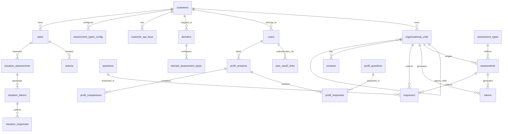

# Friktionskompasset Database Schema Documentation

## Overview

Friktionskompasset uses SQLite with Write-Ahead Logging (WAL) for better concurrent access. The database supports:

- Multi-tenant customer isolation
- Hierarchical organizational units
- Multiple assessment types (B2B organization assessments, B2C individual profiles)
- User authentication with OAuth and passwordless login
- Email tracking and templating
- Translation and internationalization
- Situation-based assessments

## Database Configuration

### Location
- **Local Development**: `friktionskompas_v3.db`
- **Render Production**: `/var/data/friktionskompas_v3.db`
- **Environment Variable**: `DB_PATH` (overrides default)

### Connection Settings
```python
# db.py handles all connections
- Timeout: 30 seconds
- Row Factory: sqlite3.Row (dict-like access)
- Foreign Keys: ENABLED (PRAGMA foreign_keys=ON)
- Journal Mode: WAL (Write-Ahead Logging)
```

### Critical Configuration
**Foreign keys are DISABLED by default in SQLite!** The application explicitly enables them on every connection via:
```sql
PRAGMA foreign_keys=ON
```
This is **CRITICAL** for CASCADE DELETE to work correctly.

---

## Entity-Relationship Diagram



---

## Core Tables

### customers
Multi-tenant customer table - each customer represents an organization using the platform.

| Column | Type | Constraints | Description |
|--------|------|-------------|-------------|
| id | TEXT | PRIMARY KEY | Format: `cust-{token}` |
| name | TEXT | NOT NULL | Customer display name |
| contact_email | TEXT | | Primary contact email |
| is_active | INTEGER | DEFAULT 1 | Soft delete flag |
| created_at | TIMESTAMP | DEFAULT CURRENT_TIMESTAMP | |
| auth_providers | TEXT | DEFAULT '{"email_password": true}' | JSON config for auth methods |
| email_from_address | TEXT | | Custom sender email |
| email_from_name | TEXT | | Custom sender name |
| allow_profile_edit | INTEGER | DEFAULT 1 | Allow users to edit profiles |

**Indexes:**
- None (small table, PK sufficient)

**Relationships:**
- Has many: organizational_units, users, domains, customer_api_keys
- Cascade: ON DELETE CASCADE (all related data deleted)

---

### organizational_units
Hierarchical tree structure for organizations - supports unlimited nesting levels.

| Column | Type | Constraints | Description |
|--------|------|-------------|-------------|
| id | TEXT | PRIMARY KEY | Format: `unit-{token}` |
| parent_id | TEXT | FK → organizational_units(id) ON DELETE CASCADE | Self-referencing hierarchy |
| name | TEXT | NOT NULL | Unit name (e.g., "HR", "Team Nord") |
| full_path | TEXT | NOT NULL | Computed path: "Top//Mid//Leaf" |
| level | INTEGER | NOT NULL DEFAULT 0 | Tree depth (0 = top level) |
| leader_name | TEXT | | Leader's full name |
| leader_email | TEXT | | Leader's email |
| employee_count | INTEGER | DEFAULT 0 | Number of employees (leaf nodes) |
| sick_leave_percent | REAL | DEFAULT 0 | Sick leave percentage |
| customer_id | TEXT | FK → customers(id) ON DELETE CASCADE | Owner customer |
| created_at | TIMESTAMP | DEFAULT CURRENT_TIMESTAMP | |

**Indexes:**
- `idx_units_parent` ON (parent_id) - Fast child lookup
- `idx_units_customer` ON (customer_id) - Customer filtering

**Relationships:**
- Belongs to: customers, organizational_units (parent)
- Has many: organizational_units (children), assessments, tokens, responses, contacts

**Important Notes:**
- `full_path` is denormalized for performance (no need for recursive queries for breadcrumbs)
- `level` is maintained automatically when moving units
- Leaf nodes (no children) are where actual work happens (assessments sent here)

---

### users
User accounts with role-based access control.

| Column | Type | Constraints | Description |
|--------|------|-------------|-------------|
| id | TEXT | PRIMARY KEY | Format: `user-{token}` |
| username | TEXT | UNIQUE NOT NULL | Login username (often email) |
| password_hash | TEXT | NOT NULL | bcrypt hash |
| name | TEXT | NOT NULL | Display name |
| email | TEXT | | Email address |
| role | TEXT | NOT NULL CHECK(role IN ('superadmin', 'admin', 'manager', 'user')) | Access level |
| customer_id | TEXT | FK → customers(id) ON DELETE CASCADE | NULL for superadmin |
| is_active | INTEGER | DEFAULT 1 | Account enabled flag |
| created_at | TIMESTAMP | DEFAULT CURRENT_TIMESTAMP | |
| last_login | TIMESTAMP | | Last successful login |
| language | TEXT | DEFAULT 'da' | UI language preference |
| recovery_email | TEXT | | Password recovery email |
| unsubscribe_token | TEXT | UNIQUE | GDPR unsubscribe token |
| email_unsubscribed | INTEGER | DEFAULT 0 | GDPR email opt-out |
| deleted_at | TIMESTAMP | | Soft delete timestamp |

**Indexes:**
- `idx_users_username` ON (username) - Fast login lookup
- `idx_users_unsubscribe_token` ON (unsubscribe_token) WHERE NOT NULL - GDPR

**Roles:**
- **superadmin**: Global admin, can see all customers (customer_id = NULL)
- **admin**: Customer admin, manages one customer
- **manager**: Unit leader, can view results for their units
- **user**: B2C end-user, takes assessments

**Relationships:**
- Belongs to: customers
- Has many: user_oauth_links, profil_sessions

---

### domains
Multi-domain support - maps hostnames to customers and configurations.

| Column | Type | Constraints | Description |
|--------|------|-------------|-------------|
| id | TEXT | PRIMARY KEY | Format: `dom-{token}` |
| domain | TEXT | UNIQUE NOT NULL | Hostname (e.g., "herning.friktionskompasset.dk") |
| customer_id | TEXT | FK → customers(id) ON DELETE SET NULL | Linked customer (NULL = generic) |
| default_language | TEXT | DEFAULT 'da' | Language for this domain |
| branding_logo_url | TEXT | | Custom logo |
| branding_primary_color | TEXT | | Brand color (hex) |
| branding_company_name | TEXT | | Display name override |
| is_active | INTEGER | DEFAULT 1 | Domain enabled |
| auth_providers | TEXT | | JSON override for auth methods |
| created_at | TIMESTAMP | DEFAULT CURRENT_TIMESTAMP | |

**Indexes:**
- `idx_domains_domain` ON (domain) - Fast hostname lookup

**Current Domains:**
- `friktionskompasset.dk` - Generic Danish (Microsoft + Google + Email)
- `frictioncompass.com` - Generic English (Microsoft + Google + Email)
- `herning.friktionskompasset.dk` - Enterprise (Microsoft only)

---

## Assessment System

### assessments (formerly campaigns)
Measurements sent to organizational units. Each assessment targets a unit and cascades to all leaf units below.

| Column | Type | Constraints | Description |
|--------|------|-------------|-------------|
| id | TEXT | PRIMARY KEY | Format: `assess-{token}` |
| target_unit_id | TEXT | FK → organizational_units(id) ON DELETE CASCADE | Where assessment is sent (NULL for individual) |
| name | TEXT | NOT NULL | Assessment name |
| period | TEXT | NOT NULL | Time period (e.g., "2025 Q1") |
| sent_from | TEXT | DEFAULT 'admin' | Sender identifier |
| sender_name | TEXT | DEFAULT 'HR' | Display name for sender |
| sent_at | TIMESTAMP | | When assessment was sent |
| scheduled_at | TIMESTAMP | | Future send time (if scheduled) |
| status | TEXT | DEFAULT 'sent' | 'sent', 'scheduled', 'completed' |
| min_responses | INTEGER | DEFAULT 5 | Anonymity threshold |
| mode | TEXT | DEFAULT 'anonymous' | 'anonymous' or 'identified' |
| include_leader_assessment | INTEGER | DEFAULT 0 | Leader assesses team |
| include_leader_self | INTEGER | DEFAULT 0 | Leader self-assessment |
| assessment_type_id | TEXT | DEFAULT 'gruppe_friktion' | Type of assessment |
| created_at | TIMESTAMP | DEFAULT CURRENT_TIMESTAMP | |

**Indexes:**
- None (queries typically by ID or filtered by date)

**Relationships:**
- Belongs to: organizational_units (target)
- Has many: tokens, responses

**Important Migration Note:**
This table was renamed from `campaigns` → `assessments` to better reflect HR/learning terminology. All foreign key references were updated in migration. **DO NOT roll back to campaign terminology!**

---

### assessment_types
Defines available assessment/measurement types.

| Column | Type | Constraints | Description |
|--------|------|-------------|-------------|
| id | TEXT | PRIMARY KEY | Short identifier (e.g., 'screening', 'profil_fuld') |
| name_da | TEXT | NOT NULL | Danish name |
| name_en | TEXT | NOT NULL | English name |
| description_da | TEXT | | Danish description |
| description_en | TEXT | | English description |
| question_count | INTEGER | | Number of questions |
| duration_minutes | INTEGER | | Estimated completion time |
| is_individual | INTEGER | DEFAULT 1 | Individual (1) or team (0) |
| is_active | INTEGER | DEFAULT 1 | Available for use |
| sequence | INTEGER | DEFAULT 0 | Display order |
| icon | TEXT | | Emoji/icon |
| storage_mode | TEXT | DEFAULT 'server' CHECK(storage_mode IN ('local', 'server', 'both')) | Where data is stored |
| created_at | TIMESTAMP | DEFAULT CURRENT_TIMESTAMP | |

**Built-in Types:**
- `screening` - Quick 6-question screening (local storage)
- `profil_fuld` - Full 30-question profile (local storage)
- `profil_situation` - Situation-specific profile (local storage)
- `gruppe_friktion` - Team friction analysis (server storage)
- `gruppe_leder` - Leader assessment (server storage)
- `kapacitet` - Capacity measurement (local storage)
- `baandbredde` - Bandwidth measurement (server storage)

---

### tokens
Access tokens for assessments - one per respondent.

| Column | Type | Constraints | Description |
|--------|------|-------------|-------------|
| token | TEXT | PRIMARY KEY | Secure random token (urlsafe) |
| assessment_id | TEXT | NOT NULL, FK → assessments(id) ON DELETE CASCADE | Which assessment |
| unit_id | TEXT | NOT NULL, FK → organizational_units(id) ON DELETE CASCADE | Which unit (NULL for individual) |
| respondent_type | TEXT | DEFAULT 'employee' | 'employee', 'leader_assess', 'leader_self', 'individual' |
| respondent_name | TEXT | | Name (for identified mode) |
| is_used | INTEGER | DEFAULT 0 | Token consumed flag |
| used_at | TIMESTAMP | | When token was used |
| created_at | TIMESTAMP | DEFAULT CURRENT_TIMESTAMP | |

**Indexes:**
- `idx_tokens_assessment_unit` ON (assessment_id, unit_id) - Fast lookup

**Token Types:**
- **employee**: Regular employee response
- **leader_assess**: Leader assessing their team
- **leader_self**: Leader self-assessment
- **individual**: B2C individual profile

---

### questions
Questions for organizational assessments (B2B).

| Column | Type | Constraints | Description |
|--------|------|-------------|-------------|
| id | INTEGER | PRIMARY KEY AUTOINCREMENT | |
| field | TEXT | NOT NULL | 'TRYGHED', 'MENING', 'KAN', 'BESVÆR' |
| text_da | TEXT | NOT NULL | Danish question text |
| text_en | TEXT | | English translation |
| reverse_scored | INTEGER | NOT NULL DEFAULT 0 | Invert score (1=bad, 5=good) |
| sequence | INTEGER | NOT NULL | Display order |
| is_default | INTEGER | NOT NULL DEFAULT 1 | Include in standard assessments |
| org_unit_id | TEXT | FK → organizational_units(id) ON DELETE CASCADE | Custom questions per org (NULL = global) |

**Field Order (Canonical):**
```python
FIELD_ORDER = ['TRYGHED', 'MENING', 'KAN', 'BESVÆR']
```

**Reverse Scoring:**
Questions with `reverse_scored=1` are inverted before analysis:
```python
adjusted_score = 6 - raw_score  # 1→5, 5→1
```

---

### responses
Answers to assessment questions.

| Column | Type | Constraints | Description |
|--------|------|-------------|-------------|
| id | INTEGER | PRIMARY KEY AUTOINCREMENT | |
| assessment_id | TEXT | NOT NULL, FK → assessments(id) ON DELETE CASCADE | Which assessment |
| unit_id | TEXT | NOT NULL, FK → organizational_units(id) ON DELETE CASCADE | Where response came from |
| question_id | INTEGER | NOT NULL, FK → questions(id) | Which question |
| score | INTEGER | NOT NULL CHECK(score BETWEEN 1 AND 5) | Likert scale answer |
| comment | TEXT | | Optional comment |
| category_comment | TEXT | | Comment per category |
| respondent_type | TEXT | DEFAULT 'employee' | Who answered |
| respondent_name | TEXT | | Name (if identified mode) |
| created_at | TIMESTAMP | DEFAULT CURRENT_TIMESTAMP | |

**Indexes:**
- `idx_responses_assessment_unit` ON (assessment_id, unit_id) - Aggregation queries
- `idx_responses_unit_assess_type` ON (unit_id, assessment_id, respondent_type) - N+1 optimization
- `idx_responses_respondent_type` ON (respondent_type) - Type filtering

---

## Individual Profile System (B2C)

### profil_questions
Questions for individual friction profiles.

| Column | Type | Constraints | Description |
|--------|------|-------------|-------------|
| id | INTEGER | PRIMARY KEY AUTOINCREMENT | |
| field | TEXT | NOT NULL | Friction field |
| layer | TEXT | NOT NULL | 'BIOLOGI', 'EMOTION', 'INDRE', 'KOGNITION', 'EKSTERN' |
| text_da | TEXT | NOT NULL | Question text (trait) |
| state_text_da | TEXT | | State-based version ("right now...") |
| text_en | TEXT | | English translation |
| state_text_en | TEXT | | English state version |
| question_type | TEXT | DEFAULT 'sensitivity' | 'sensitivity', 'capacity', 'bandwidth', 'screening', 'baseline' |
| reverse_scored | INTEGER | DEFAULT 0 | Invert scoring |
| sequence | INTEGER | NOT NULL | Display order |
| created_at | TIMESTAMP | DEFAULT CURRENT_TIMESTAMP | |

**Question Types:**
- **sensitivity** (16 items): Core 4x4 matrix
- **capacity** (8 items): "Pull yourself together" mechanism
- **bandwidth** (2 items): Ability to push pressure upward
- **screening** (6 items): Quick assessment
- **baseline** (8 items): Biological/emotional thresholds

---

### profil_sessions
Individual profile measurement sessions.

| Column | Type | Constraints | Description |
|--------|------|-------------|-------------|
| id | TEXT | PRIMARY KEY | Format: `profil-{token}` |
| person_name | TEXT | | Name (optional) |
| person_email | TEXT | | Email (optional) |
| context | TEXT | DEFAULT 'general' | 'general', 'test', custom |
| measurement_type | TEXT | DEFAULT 'profile' | 'profile', 'screening', 'situation' |
| situation_context | TEXT | | Description of specific situation |
| customer_id | TEXT | FK → customers(id) | Optional link to customer |
| unit_id | TEXT | FK → organizational_units(id) | Optional link to unit |
| is_complete | INTEGER | DEFAULT 0 | Session finished |
| created_at | TIMESTAMP | DEFAULT CURRENT_TIMESTAMP | |
| completed_at | TIMESTAMP | | Completion time |

**Indexes:**
- `idx_profil_sessions_customer` ON (customer_id) - Customer filtering

---

### profil_responses
Answers to profile questions.

| Column | Type | Constraints | Description |
|--------|------|-------------|-------------|
| id | INTEGER | PRIMARY KEY AUTOINCREMENT | |
| session_id | TEXT | NOT NULL, FK → profil_sessions(id) ON DELETE CASCADE | Which session |
| question_id | INTEGER | NOT NULL, FK → profil_questions(id) | Which question |
| score | INTEGER | NOT NULL CHECK(score BETWEEN 1 AND 5) | Likert answer |
| created_at | TIMESTAMP | DEFAULT CURRENT_TIMESTAMP | |

**Indexes:**
- `idx_profil_responses_session` ON (session_id) - Fast retrieval

---

### profil_comparisons
Compare two profiles (e.g., partners, situations).

| Column | Type | Constraints | Description |
|--------|------|-------------|-------------|
| id | TEXT | PRIMARY KEY | Format: `comp-{token}` |
| session_id_1 | TEXT | NOT NULL, FK → profil_sessions(id) | First profile |
| session_id_2 | TEXT | NOT NULL, FK → profil_sessions(id) | Second profile |
| context | TEXT | | Comparison purpose |
| notes | TEXT | | User notes |
| created_at | TIMESTAMP | DEFAULT CURRENT_TIMESTAMP | |

---

## Advanced Profile System (Screening + Deep)

### fp_screening_questions
Screening questions (13 items) for quick profile assessment.

| Column | Type | Constraints | Description |
|--------|------|-------------|-------------|
| id | TEXT | PRIMARY KEY | Format: `sq-{S1..S13}` |
| question_id | TEXT | NOT NULL UNIQUE | Short ID (S1, S2, etc.) |
| section | TEXT | NOT NULL | 'felt', 'opad', 'manifest' |
| target | TEXT | NOT NULL | What is being measured |
| text_da | TEXT | NOT NULL | Question text |
| text_en | TEXT | | English translation |
| sort_order | INTEGER | | Display order |

**Sections:**
- **A: Felter** (4 items) - Core friction fields
- **B: Opad-kæden** (4 items) - Upward chain
- **C: Manifestation** (5 items) - Where friction shows up

---

### fp_screening_sessions
Screening measurement sessions.

| Column | Type | Constraints | Description |
|--------|------|-------------|-------------|
| id | TEXT | PRIMARY KEY | Format: `scr-{token}` |
| person_name | TEXT | | Optional name |
| person_email | TEXT | | Optional email |
| customer_id | TEXT | FK → customers(id) | Optional |
| unit_id | TEXT | FK → organizational_units(id) | Optional |
| context | TEXT | DEFAULT 'general' | Context |
| is_complete | INTEGER | DEFAULT 0 | Finished |
| created_at | TIMESTAMP | DEFAULT CURRENT_TIMESTAMP | |
| completed_at | TIMESTAMP | | When completed |

---

### fp_screening_responses
Answers to screening questions (1-7 scale).

| Column | Type | Constraints | Description |
|--------|------|-------------|-------------|
| id | TEXT | PRIMARY KEY | Format: `sr-{token}` |
| session_id | TEXT | NOT NULL, FK → fp_screening_sessions(id) ON DELETE CASCADE | Session |
| question_id | TEXT | NOT NULL | Question ID (S1-S13) |
| score | INTEGER | NOT NULL CHECK(score BETWEEN 1 AND 7) | 7-point Likert |
| created_at | TIMESTAMP | DEFAULT CURRENT_TIMESTAMP | |

**Indexes:**
- `idx_fp_screening_responses_session` ON (session_id)

---

### fp_screening_scores
Calculated scores from screening.

| Column | Type | Constraints | Description |
|--------|------|-------------|-------------|
| id | TEXT | PRIMARY KEY | Format: `ss-{token}` |
| session_id | TEXT | NOT NULL UNIQUE, FK → fp_screening_sessions(id) ON DELETE CASCADE | Session |
| felt_tryghed | INTEGER | | Safety score |
| felt_mening | INTEGER | | Meaning score |
| felt_kan | INTEGER | | Capability score |
| felt_besvaer | INTEGER | | Effort score |
| primaert_felt | TEXT | | Primary friction field |
| opad_bio_emo | INTEGER | | Bio→Emotion transition |
| opad_emo_indre | INTEGER | | Emotion→Inner transition |
| opad_indre_kog | INTEGER | | Inner→Cognition transition |
| opad_kog_ekstern | INTEGER | | Cognition→External transition |
| stop_punkt | TEXT | | Where chain breaks |
| manifest_biologi | INTEGER | | Biology manifestation |
| manifest_emotion | INTEGER | | Emotion manifestation |
| manifest_indre | INTEGER | | Inner manifestation |
| manifest_kognition | INTEGER | | Cognition manifestation |
| manifest_ekstern | INTEGER | | External manifestation |
| primaert_lag | TEXT | | Primary manifestation layer |
| created_at | TIMESTAMP | DEFAULT CURRENT_TIMESTAMP | |

---

### fp_deep_questions
Deep measurement questions (88 items).

| Column | Type | Constraints | Description |
|--------|------|-------------|-------------|
| id | TEXT | PRIMARY KEY | Format: `dq-{A1..F10}` |
| question_id | TEXT | NOT NULL UNIQUE | ID (A1, B12, etc.) |
| section | TEXT | NOT NULL | 'A' (fields), 'B' (bandwidth), 'C' (manifest), 'D' (regulation), 'E' (capacity), 'F' (consumption) |
| field | TEXT | | Friction field (Section A) |
| layer | TEXT | | Layer (Section C) |
| transition | TEXT | | Transition type (Section B, E) |
| direction | TEXT | | 'up' or 'down' (Section B) |
| strategy | TEXT | | Regulation strategy (Section D) |
| subsection | TEXT | | 'frequency' or 'dependency' (Section F) |
| category | TEXT | | 'stof' or 'adfaerd' (Section F) |
| is_reverse | INTEGER | DEFAULT 0 | Reverse scoring |
| text_da | TEXT | NOT NULL | Question text |
| text_en | TEXT | | English translation |
| sort_order | INTEGER | | Display order |

**Sections:**
- **A: Felter** (16 items) - Baseline friction
- **B: Båndbredde-problemer** (32 items) - Up/down chain problems
- **C: Manifestationslag** (10 items) - Where friction manifests
- **D: Reguleringsstrategier** (12 items) - Coping strategies
- **E: Opad-kapacitet** (8 items) - Upward processing capacity
- **F: Forbrugsmønstre** (10 items) - Consumption patterns

---

### fp_deep_sessions
Deep measurement sessions.

| Column | Type | Constraints | Description |
|--------|------|-------------|-------------|
| id | TEXT | PRIMARY KEY | Format: `deep-{token}` |
| person_name | TEXT | | Optional name |
| person_email | TEXT | | Optional email |
| customer_id | TEXT | FK → customers(id) | Optional |
| unit_id | TEXT | FK → organizational_units(id) | Optional |
| context | TEXT | DEFAULT 'general' | Context |
| is_complete | INTEGER | DEFAULT 0 | Finished |
| created_at | TIMESTAMP | DEFAULT CURRENT_TIMESTAMP | |
| completed_at | TIMESTAMP | | When completed |

---

### fp_deep_responses
Answers to deep questions (1-7 scale).

| Column | Type | Constraints | Description |
|--------|------|-------------|-------------|
| id | TEXT | PRIMARY KEY | Format: `dr-{token}` |
| session_id | TEXT | NOT NULL, FK → fp_deep_sessions(id) ON DELETE CASCADE | Session |
| question_id | TEXT | NOT NULL | Question ID (A1-F10) |
| score | INTEGER | NOT NULL CHECK(score BETWEEN 1 AND 7) | 7-point Likert |
| created_at | TIMESTAMP | DEFAULT CURRENT_TIMESTAMP | |

**Indexes:**
- `idx_fp_deep_responses_session` ON (session_id)

---

### fp_deep_scores
Comprehensive calculated scores from deep measurement.

| Column | Type | Constraints | Description |
|--------|------|-------------|-------------|
| id | TEXT | PRIMARY KEY | Format: `ds-{token}` |
| session_id | TEXT | NOT NULL UNIQUE, FK → fp_deep_sessions(id) ON DELETE CASCADE | Session |
| field_tryghed | REAL | | Safety field average |
| field_mening | REAL | | Meaning field average |
| field_kan | REAL | | Capability field average |
| field_besvaer | REAL | | Effort field average |
| problem_bio_emo | REAL | | Bio→Emotion problem score (upward) |
| problem_emo_indre | REAL | | Emotion→Inner problem score (upward) |
| problem_indre_kog | REAL | | Inner→Cognition problem score (upward) |
| problem_kog_ekstern | REAL | | Cognition→External problem score (upward) |
| problem_ekstern_kog | REAL | | External→Cognition problem score (downward) |
| problem_kog_indre | REAL | | Cognition→Inner problem score (downward) |
| problem_indre_emo | REAL | | Inner→Emotion problem score (downward) |
| problem_emo_bio | REAL | | Emotion→Bio problem score (downward) |
| kapacitet_bio_emo | REAL | | Bio→Emotion capacity (upward) |
| kapacitet_emo_indre | REAL | | Emotion→Inner capacity (upward) |
| kapacitet_indre_kog | REAL | | Inner→Cognition capacity (upward) |
| kapacitet_kog_ekstern | REAL | | Cognition→External capacity (upward) |
| kapacitet_ekstern_kog | REAL | | External→Cognition capacity (downward) |
| kapacitet_kog_indre | REAL | | Cognition→Inner capacity (downward) |
| kapacitet_indre_emo | REAL | | Inner→Emotion capacity (downward) |
| kapacitet_emo_bio | REAL | | Emotion→Bio capacity (downward) |
| index_bio_emo | REAL | | Combined index: (capacity + (8-problem))/2 |
| index_emo_indre | REAL | | Combined index |
| index_indre_kog | REAL | | Combined index |
| index_kog_ekstern | REAL | | Combined index |
| index_ekstern_kog | REAL | | Combined index |
| index_kog_indre | REAL | | Combined index |
| index_indre_emo | REAL | | Combined index |
| index_emo_bio | REAL | | Combined index |
| manifest_biologi | REAL | | Biology manifestation |
| manifest_emotion | REAL | | Emotion manifestation |
| manifest_kognition | REAL | | Cognition manifestation |
| manifest_indre | REAL | | Inner manifestation |
| manifest_ekstern | REAL | | External manifestation |
| reg_kropslig | REAL | | Physical regulation strategy |
| reg_emotionel | REAL | | Emotional regulation strategy |
| reg_indre | REAL | | Inner regulation strategy |
| reg_kognitiv | REAL | | Cognitive regulation strategy |
| reg_ekstern | REAL | | External regulation strategy |
| reg_robusthed | REAL | | Robustness of strategies |
| forbrug_stof | REAL | | Substance consumption |
| forbrug_adfaerd | REAL | | Behavioral consumption |
| forbrug_total | REAL | | Total consumption |
| afhaengighed | REAL | | Dependency level |
| primary_field | TEXT | | Main friction field |
| stop_point | TEXT | | Where upward chain breaks (lowest index) |
| primary_manifest | TEXT | | Primary manifestation layer |
| primary_regulation | TEXT | | Primary regulation strategy |
| chain_status | TEXT | | 'intact', 'partial', 'broken' |
| created_at | TIMESTAMP | DEFAULT CURRENT_TIMESTAMP | |

---

## Situation Assessment System

### tasks
Tasks for situation-based assessments.

| Column | Type | Constraints | Description |
|--------|------|-------------|-------------|
| id | TEXT | PRIMARY KEY | Format: `task-{token}` |
| customer_id | TEXT | NOT NULL, FK → customers(id) ON DELETE CASCADE | Owner |
| unit_id | TEXT | FK → organizational_units(id) ON DELETE SET NULL | Optional unit link |
| name | TEXT | NOT NULL | Task name |
| description | TEXT | | Task description |
| situation | TEXT | | Situation context |
| created_by | TEXT | | Creator user ID |
| created_at | TIMESTAMP | DEFAULT CURRENT_TIMESTAMP | |

---

### actions
Actions within a task (2-5 per task).

| Column | Type | Constraints | Description |
|--------|------|-------------|-------------|
| id | TEXT | PRIMARY KEY | Format: `action-{token}` |
| task_id | TEXT | NOT NULL, FK → tasks(id) ON DELETE CASCADE | Parent task |
| name | TEXT | NOT NULL | Action name |
| description | TEXT | | Action description |
| sequence | INTEGER | DEFAULT 0 | Display order |

---

### situation_assessments
Assessments for specific tasks.

| Column | Type | Constraints | Description |
|--------|------|-------------|-------------|
| id | TEXT | PRIMARY KEY | Format: `sitass-{token}` |
| task_id | TEXT | NOT NULL, FK → tasks(id) ON DELETE CASCADE | Which task |
| unit_id | TEXT | FK → organizational_units(id) ON DELETE SET NULL | Optional unit |
| name | TEXT | | Assessment name |
| period | TEXT | | Time period |
| sent_from | TEXT | | Sender identifier |
| sender_name | TEXT | | Sender display name |
| created_at | TIMESTAMP | DEFAULT CURRENT_TIMESTAMP | |

---

### situation_tokens
Access tokens for situation assessments.

| Column | Type | Constraints | Description |
|--------|------|-------------|-------------|
| token | TEXT | PRIMARY KEY | Secure random token |
| situation_assessment_id | TEXT | NOT NULL, FK → situation_assessments(id) ON DELETE CASCADE | Which assessment |
| recipient_email | TEXT | | Recipient email |
| recipient_name | TEXT | | Recipient name |
| is_used | INTEGER | DEFAULT 0 | Token consumed |
| used_at | TIMESTAMP | | When used |
| created_at | TIMESTAMP | DEFAULT CURRENT_TIMESTAMP | |

---

### situation_responses
Responses per action per field.

| Column | Type | Constraints | Description |
|--------|------|-------------|-------------|
| id | INTEGER | PRIMARY KEY AUTOINCREMENT | |
| token | TEXT | NOT NULL, FK → situation_tokens(token) ON DELETE CASCADE | Which token |
| action_id | TEXT | NOT NULL, FK → actions(id) ON DELETE CASCADE | Which action |
| field | TEXT | NOT NULL | Friction field |
| score | INTEGER | CHECK(score BETWEEN 1 AND 5) | Likert score |
| created_at | TIMESTAMP | DEFAULT CURRENT_TIMESTAMP | |

---

## Authentication & Authorization

### user_oauth_links
Links users to OAuth providers (Microsoft, Google).

| Column | Type | Constraints | Description |
|--------|------|-------------|-------------|
| id | INTEGER | PRIMARY KEY AUTOINCREMENT | |
| user_id | TEXT | NOT NULL, FK → users(id) ON DELETE CASCADE | Linked user |
| provider | TEXT | NOT NULL | 'microsoft' or 'google' |
| provider_user_id | TEXT | NOT NULL | Provider's user ID |
| provider_email | TEXT | | Provider email |
| access_token | TEXT | | OAuth access token |
| refresh_token | TEXT | | OAuth refresh token |
| token_expires_at | TIMESTAMP | | Token expiry |
| created_at | TIMESTAMP | DEFAULT CURRENT_TIMESTAMP | |

**Indexes:**
- `idx_oauth_provider_user` ON (provider, provider_user_id) - OAuth lookup
- UNIQUE constraint on (provider, provider_user_id)

---

### email_codes
Email verification codes for passwordless login and password reset.

| Column | Type | Constraints | Description |
|--------|------|-------------|-------------|
| id | INTEGER | PRIMARY KEY AUTOINCREMENT | |
| email | TEXT | NOT NULL | Recipient email |
| code | TEXT | NOT NULL | 6-digit code |
| code_type | TEXT | NOT NULL CHECK(code_type IN ('login', 'register', 'reset')) | Purpose |
| expires_at | TIMESTAMP | NOT NULL | Expiry time (15 min default) |
| used | INTEGER | DEFAULT 0 | Code consumed |
| created_at | TIMESTAMP | DEFAULT CURRENT_TIMESTAMP | |

**Indexes:**
- `idx_email_codes_email` ON (email, code_type, used) - Fast validation

**Usage:**
```python
# Generate code (15 min expiry)
code = generate_email_code(email, 'login')

# Verify code
if verify_email_code(email, code, 'login'):
    # Code valid and now marked as used
```

---

### customer_api_keys
API keys for REST API access.

| Column | Type | Constraints | Description |
|--------|------|-------------|-------------|
| id | INTEGER | PRIMARY KEY AUTOINCREMENT | |
| customer_id | TEXT | NOT NULL, FK → customers(id) ON DELETE CASCADE | Owner customer |
| key_hash | TEXT | NOT NULL | bcrypt hash of full key |
| key_prefix | TEXT | NOT NULL UNIQUE | Format: `fk_{customer}_{suffix}` |
| name | TEXT | DEFAULT 'API Key' | Key nickname |
| permissions | TEXT | DEFAULT '{"read": true, "write": false}' | JSON permissions |
| rate_limit | INTEGER | DEFAULT 100 | Requests per minute |
| is_active | INTEGER | DEFAULT 1 | Key enabled |
| last_used_at | TIMESTAMP | | Last usage |
| created_at | TIMESTAMP | DEFAULT CURRENT_TIMESTAMP | |

**Indexes:**
- `idx_api_keys_prefix` ON (key_prefix) - Fast validation
- `idx_api_keys_customer` ON (customer_id) - Listing

**Key Format:**
```
fk_{customer_short}_{key_suffix}_{random_secret}
  └─────── prefix ──────┘└───── secret ─────┘
```

---

## Multi-Assessment Configuration

### customer_assessment_types
Which assessment types are enabled per customer.

| Column | Type | Constraints | Description |
|--------|------|-------------|-------------|
| id | INTEGER | PRIMARY KEY AUTOINCREMENT | |
| customer_id | TEXT | NOT NULL, FK → customers(id) ON DELETE CASCADE | Customer |
| assessment_type_id | TEXT | NOT NULL, FK → assessment_types(id) ON DELETE CASCADE | Type |
| is_enabled | INTEGER | DEFAULT 1 | Enabled flag |
| custom_name_da | TEXT | | Override Danish name |
| custom_name_en | TEXT | | Override English name |

**Indexes:**
- `idx_customer_assessment_types` ON (customer_id)
- UNIQUE constraint on (customer_id, assessment_type_id)

---

### domain_assessment_types
Per-domain overrides for assessment types.

| Column | Type | Constraints | Description |
|--------|------|-------------|-------------|
| id | INTEGER | PRIMARY KEY AUTOINCREMENT | |
| domain_id | TEXT | NOT NULL, FK → domains(id) ON DELETE CASCADE | Domain |
| assessment_type_id | TEXT | NOT NULL, FK → assessment_types(id) ON DELETE CASCADE | Type |
| is_enabled | INTEGER | DEFAULT 1 | Enabled flag |

**Indexes:**
- `idx_domain_assessment_types` ON (domain_id)
- UNIQUE constraint on (domain_id, assessment_type_id)

---

### assessment_presets
Predefined combinations of assessment types.

| Column | Type | Constraints | Description |
|--------|------|-------------|-------------|
| id | INTEGER | PRIMARY KEY AUTOINCREMENT | |
| name | TEXT | NOT NULL | Preset name |
| description | TEXT | | Description |
| is_default | INTEGER | DEFAULT 0 | Default preset flag |
| created_at | TIMESTAMP | DEFAULT CURRENT_TIMESTAMP | |

**Built-in Presets:**
- **B2C Individuel**: screening, profil_fuld
- **B2B Standard**: screening, profil_fuld, gruppe_friktion
- **Enterprise Full**: All 7 types (default)

---

### preset_assessment_types
Which types are in each preset.

| Column | Type | Constraints | Description |
|--------|------|-------------|-------------|
| preset_id | INTEGER | NOT NULL, FK → assessment_presets(id) ON DELETE CASCADE | Preset |
| assessment_type_id | TEXT | NOT NULL, FK → assessment_types(id) ON DELETE CASCADE | Type |

**Composite Primary Key:** (preset_id, assessment_type_id)

---

## Translation & i18n

### translations
Database-based translations for internationalization.

| Column | Type | Constraints | Description |
|--------|------|-------------|-------------|
| id | INTEGER | PRIMARY KEY AUTOINCREMENT | |
| key | TEXT | NOT NULL | Translation key (e.g., 'auth.login.title') |
| language | TEXT | NOT NULL | Language code ('da', 'en') |
| value | TEXT | NOT NULL | Translated text |
| context | TEXT | | Usage context/notes |

**Indexes:**
- `idx_translations_key_lang` ON (key, language) - Fast lookup
- UNIQUE constraint on (key, language)

**Seeding:**
```bash
# After deployment
curl https://friktionskompasset.dk/admin/seed-translations
```

---

## Email & Communication

### email_logs
Email delivery tracking.

| Column | Type | Constraints | Description |
|--------|------|-------------|-------------|
| id | INTEGER | PRIMARY KEY AUTOINCREMENT | |
| message_id | TEXT | | Mailjet message ID |
| to_email | TEXT | NOT NULL | Recipient |
| subject | TEXT | | Email subject |
| email_type | TEXT | DEFAULT 'invitation' | 'invitation', 'reminder', etc. |
| status | TEXT | DEFAULT 'sent' | 'sent', 'delivered', 'bounced', 'opened', 'clicked' |
| assessment_id | TEXT | FK → assessments(id) ON DELETE SET NULL | Related assessment |
| token | TEXT | | Related token |
| error_message | TEXT | | Error details if failed |
| delivered_at | TIMESTAMP | | Delivery confirmation |
| opened_at | TIMESTAMP | | Open tracking |
| clicked_at | TIMESTAMP | | Click tracking |
| bounced_at | TIMESTAMP | | Bounce timestamp |
| created_at | TIMESTAMP | DEFAULT CURRENT_TIMESTAMP | |

---

### email_templates
Custom email templates per customer.

| Column | Type | Constraints | Description |
|--------|------|-------------|-------------|
| id | INTEGER | PRIMARY KEY AUTOINCREMENT | |
| customer_id | INTEGER | FK → customers(id) ON DELETE CASCADE | Owner (NULL = global) |
| template_type | TEXT | NOT NULL | 'invitation', 'reminder', 'thank_you' |
| subject | TEXT | NOT NULL | Email subject |
| html_content | TEXT | NOT NULL | HTML body |
| text_content | TEXT | | Plain text fallback |
| is_active | INTEGER | DEFAULT 1 | Template enabled |
| created_at | TIMESTAMP | DEFAULT CURRENT_TIMESTAMP | |
| updated_at | TIMESTAMP | DEFAULT CURRENT_TIMESTAMP | |

---

### contacts
Contact information for organizational units.

| Column | Type | Constraints | Description |
|--------|------|-------------|-------------|
| id | INTEGER | PRIMARY KEY AUTOINCREMENT | |
| unit_id | TEXT | NOT NULL, FK → organizational_units(id) ON DELETE CASCADE | Unit |
| email | TEXT | | Email address |
| phone | TEXT | | Phone number |
| created_at | TIMESTAMP | DEFAULT CURRENT_TIMESTAMP | |

---

## Common Query Patterns

### Get All Leaf Units for Assessment
```sql
WITH RECURSIVE subtree AS (
    SELECT * FROM organizational_units WHERE id = ?
    UNION ALL
    SELECT ou.* FROM organizational_units ou
    JOIN subtree st ON ou.parent_id = st.id
)
SELECT st.* FROM subtree st
LEFT JOIN organizational_units children ON st.id = children.parent_id
WHERE children.id IS NULL
ORDER BY st.full_path
```

### Get Unit Statistics with Anonymity Check
```sql
SELECT
    q.field,
    AVG(CASE
        WHEN q.reverse_scored = 1 THEN 6 - r.score
        ELSE r.score
    END) as avg_score,
    COUNT(r.id) as response_count
FROM questions q
LEFT JOIN responses r ON q.id = r.question_id
    AND r.unit_id = ? AND r.assessment_id = ?
WHERE q.is_default = 1
GROUP BY q.field
HAVING COUNT(r.id) >= ?  -- min_responses threshold
```

### Customer Filtering for Multi-Tenant
```sql
-- Superadmin with optional filter
SELECT * FROM organizational_units
WHERE (? IS NULL OR customer_id = ?)  -- session customer_filter

-- Manager with fixed customer_id
SELECT * FROM organizational_units
WHERE customer_id = ?
```

---

## Database Migrations

### Historical Migrations

#### campaign → assessment (Completed)
**Date:** Early in project (2025)
**Reason:** "Campaign" sounds marketing-focused. "Assessment" better fits HR/learning context.
**Changes:**
- Table: `campaigns` → `assessments`
- Column: `responses.campaign_id` → `responses.assessment_id`
- Column: `tokens.campaign_id` → `tokens.assessment_id`
- Migration runs automatically in `db_hierarchical.py:migrate_campaign_to_assessment()`

**CRITICAL:** This migration is permanent. DO NOT roll back to campaign terminology!

#### superadmin Role (Completed)
**Date:** Multi-tenant refactoring
**Reason:** Separate global admins from customer admins
**Changes:**
- CHECK constraint updated to allow 'superadmin' role
- Existing admin users without customer_id promoted to superadmin
- Migration in `db_multitenant.py:init_multitenant_db()`

#### storage_mode Column (Completed)
**Date:** B2C/B2B storage separation
**Reason:** Individual profiles stored in browser (localStorage), organization data on server
**Changes:**
- Added `assessment_types.storage_mode` column
- Values: 'local', 'server', 'both'
- Migration in `db_multitenant.py:init_multitenant_db()`

### Migration Best Practices

1. **Always check column existence before ALTER TABLE:**
```python
columns = conn.execute("PRAGMA table_info(table_name)").fetchall()
column_names = [col['name'] for col in columns]
if 'new_column' not in column_names:
    conn.execute("ALTER TABLE table_name ADD COLUMN new_column TEXT")
```

2. **Use migrations for schema changes, not data:**
- Schema changes: Migrations
- Data seeding: Separate seed functions

3. **Test migrations on copy of production database first**

4. **Document migrations in CLAUDE.md immediately**

---

## Backup & Restore

### Export Database as Base64
```bash
python -c "import base64; open('db_backup.b64','w').write(base64.b64encode(open('friktionskompas_v3.db','rb').read()).decode())"
git add db_backup.b64
git commit -m "Database backup"
git push
```

### Restore on Render
```bash
curl -X POST https://friktionskompasset.dk/admin/restore-db-from-backup \
     -H "X-Admin-API-Key: w_r0xNlJAzAm7XSKARbo2T4GkKCePxiqXroB2w0o29s"
```

### JSON Export (Alternative)
```python
import sqlite3, json
conn = sqlite3.connect('friktionskompas_v3.db')
conn.row_factory = sqlite3.Row
data = {
    'organizational_units': [dict(r) for r in conn.execute('SELECT * FROM organizational_units').fetchall()],
    'assessments': [dict(r) for r in conn.execute('SELECT * FROM assessments').fetchall()],
    'responses': [dict(r) for r in conn.execute('SELECT * FROM responses').fetchall()],
}
with open('backup.json', 'w', encoding='utf-8') as f:
    json.dump(data, f, ensure_ascii=False, indent=2, default=str)
```

---

## Performance Considerations

### Indexes Summary
All indexes are created with `CREATE INDEX IF NOT EXISTS` to avoid duplicates.

**High-traffic queries:**
- `idx_users_username` - Every login
- `idx_tokens_assessment_unit` - Token validation
- `idx_responses_assessment_unit` - Analysis aggregation
- `idx_responses_unit_assess_type` - N+1 query optimization (added 2025-12-20)

**Query Optimization Example:**
Before (N+1 problem):
```python
for unit in units:
    responses = query("SELECT * FROM responses WHERE unit_id=? AND assessment_id=?", unit_id, assessment_id)
```

After (single query):
```sql
SELECT r.*, ou.name
FROM responses r
JOIN organizational_units ou ON r.unit_id = ou.id
WHERE r.assessment_id = ?
```

Result: 41 queries → 2 queries (95% reduction) for 20 units

---

## Security

### Authentication
- Passwords hashed with **bcrypt** (not plain SHA256)
- OAuth tokens encrypted at rest
- Email codes expire after 15 minutes

### Authorization
```python
def get_customer_filter(user_role, customer_id, session_filter):
    if customer_id:  # Manager
        return ("ou.customer_id = ?", [customer_id])
    if session_filter:  # Admin/Superadmin with filter
        return ("ou.customer_id = ?", [session_filter])
    return ("1=1", [])  # Superadmin without filter
```

### API Keys
- Full key shown ONCE at creation
- Only prefix and bcrypt hash stored
- Rate limiting: 100 req/min default
- Format: `fk_{customer}_{suffix}_{secret}`

---

## Environment Variables

### Required
- `DATABASE_URL` - Not used (SQLite, not PostgreSQL)
- `SECRET_KEY` - Flask session secret
- `ADMIN_API_KEY` - Admin API authentication

### Optional
- `DB_PATH` - Override database location (for tests)
- `MICROSOFT_CLIENT_ID`, `MICROSOFT_CLIENT_SECRET`, `MICROSOFT_TENANT_ID` - OAuth
- `GOOGLE_CLIENT_ID`, `GOOGLE_CLIENT_SECRET` - OAuth
- `MAILJET_API_KEY`, `MAILJET_API_SECRET` - Email delivery
- `FROM_EMAIL`, `FROM_NAME` - Default email sender

---

## Testing

### Test Database
```python
import os
os.environ['DB_PATH'] = ':memory:'  # In-memory for tests
```

### Canonical Test Data
**Esbjerg Kommune** (`cust-SHKIi10cOe8`) - DO NOT CHANGE!
- Documented in `ESBJERG_TESTDATA.md`
- Tests: `tests/test_esbjerg_canonical.py`
- Purpose: Regression testing

**Herning Kommune** (`cust-0nlG8ldxSYU`) - Demo data
- Can be modified freely
- Seed: `python seed_herning_testdata.py`

---

## Future Considerations

### Potential Optimizations
1. **Materialized views** for complex aggregations
2. **Redis cache** for frequently accessed data
3. **Read replicas** for analytics queries
4. **Partitioning** for responses table (by date)

### Known Limitations
- SQLite doesn't support ALTER COLUMN (requires table recreation)
- CHECK constraints can't be modified (requires migration)
- No built-in enum types (use TEXT with CHECK)
- Foreign key constraints require explicit PRAGMA

---

## References

- **Main Schema Files:**
  - `db.py` - Core database functions
  - `db_multitenant.py` - Multi-tenancy tables
  - `db_hierarchical.py` - Organizational structure
  - `db_profil.py` - Individual profiles (legacy)
  - `db_friktionsprofil.py` - Advanced profiling system

- **Analysis Logic:** `ANALYSELOGIK.md`
- **Architecture Decisions:** `CLAUDE.md`
- **Canonical Test Data:** `ESBJERG_TESTDATA.md`

---

**Last Updated:** 2025-12-22
**Database Version:** v3 (hierarchical + multi-tenant)
**Schema Version:** Latest migration includes storage_mode and advanced profiling
